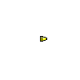

# Cannon

## Steps
- Create a sprite
- Create another similar sprite for animation
- Create projectiles
- Give it damage, range, and price stats
- Damage the enemy

## Images

| Name             | Preview                          |
|------------------|----------------------------------|
| Cannon Frame 1   |    |
| Cannon Frame 2   |    |
| Cannon's Bullet  |  |
| Full Animation   | |

