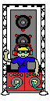
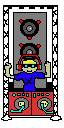
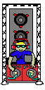

# Snippet Code
```java
public void playTowerAnimation(PImage DJ1, PImage DJ2, PImage DJ3, int time) {
        if (stageLevel == 1) {
            if (time%300 == 0) {
                stageLevel = 2;
                p.image(DJ2, (float) super.getXPos(), (float) super.getYPos());
                return;
            } 
            p.image(DJ1, (float) super.getXPos(), (float) super.getYPos());
        } else if (stageLevel == 2) {
            if (time%750 == 0) {
                stageLevel = 3;
                p.image(DJ3, (float) super.getXPos(), (float) super.getYPos());
                return;
            }
            p.image(DJ2, (float) super.getXPos(), (float) super.getYPos());
            
        } else {
            p.image(DJ3, (float) super.getXPos(), (float) super.getYPos());
        }
    }
```

# Summary
Above, is a method I created to play the DJ animation. I really wanted to add music whenever there is a DJ on the map, but unfortunately, I don't think Pickcode supports sounds on their website or I didn't know how to add it yet.
The DJ is a support tower that buffs firerate of each tower by 2X.
## Images

| Name             | Preview                          |
|------------------|----------------------------------|
| DJ Frame 1   |    |
| DJ Frame 2   |    |
| DJ Frame 3   |    |

