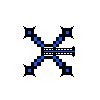
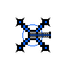
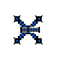
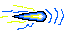

# Snippet Code
```java
public class MythicCannon extends Cannon{
    public MythicCannon(PApplet p, int damage, double fireRate, double price, int xPos, int yPos, int row, ArrayList<Enemy> enemies, ArrayList<Boss> bosses) {
        super(p, damage, fireRate, price, xPos, yPos, row, enemies, bosses);
      
    }
}
```

# Summary
There are not much code for this tower because it uses inheritance. This tower has many similar property to the cannon. The only difference is their sprites and stats. 

## Images

| Name             | Preview                          |
|------------------|----------------------------------|
| Mythic Cannon Frame 1   |    |
| Mythic Cannon Frame 2   |    |
| Mythic Cannon Frame 3   |    |
| Mythic Cannon Frame 4   |    |
| Mythic Cannon's Bullet  |  |
| Full Animation   | |
